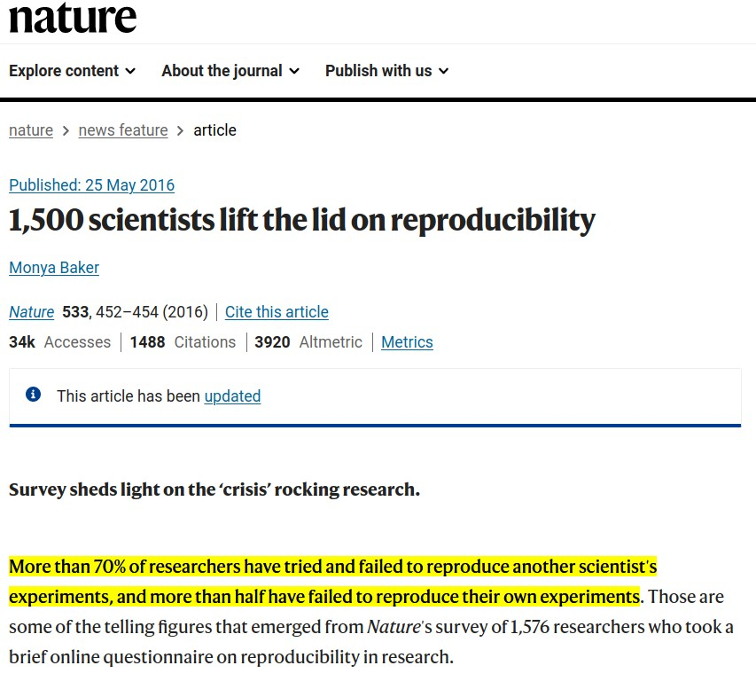
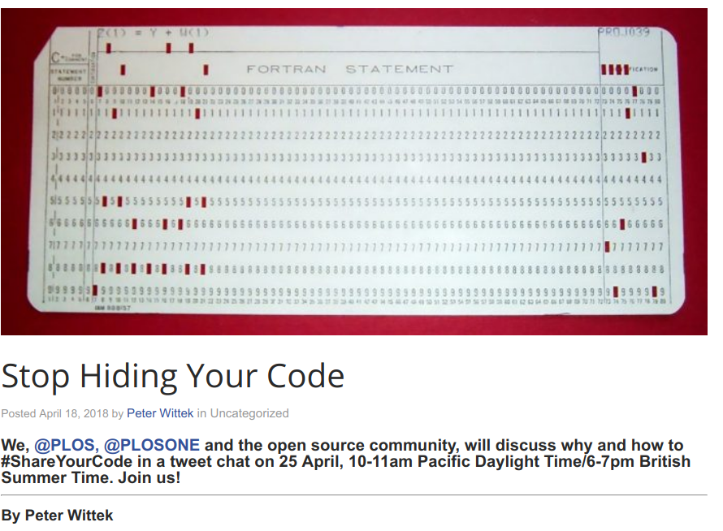
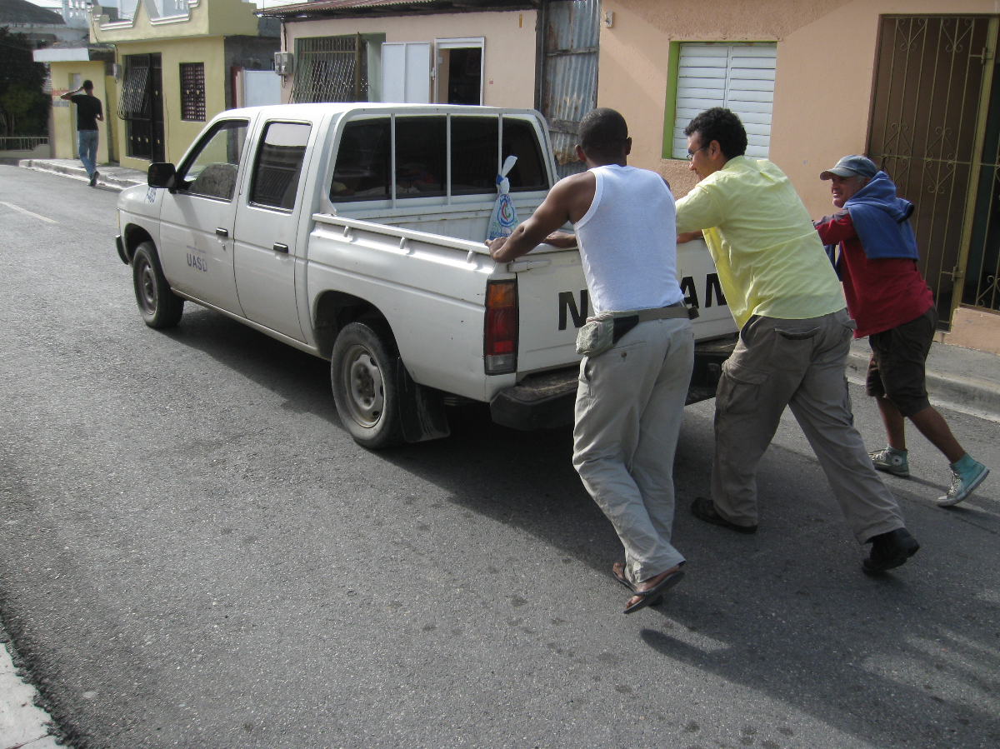
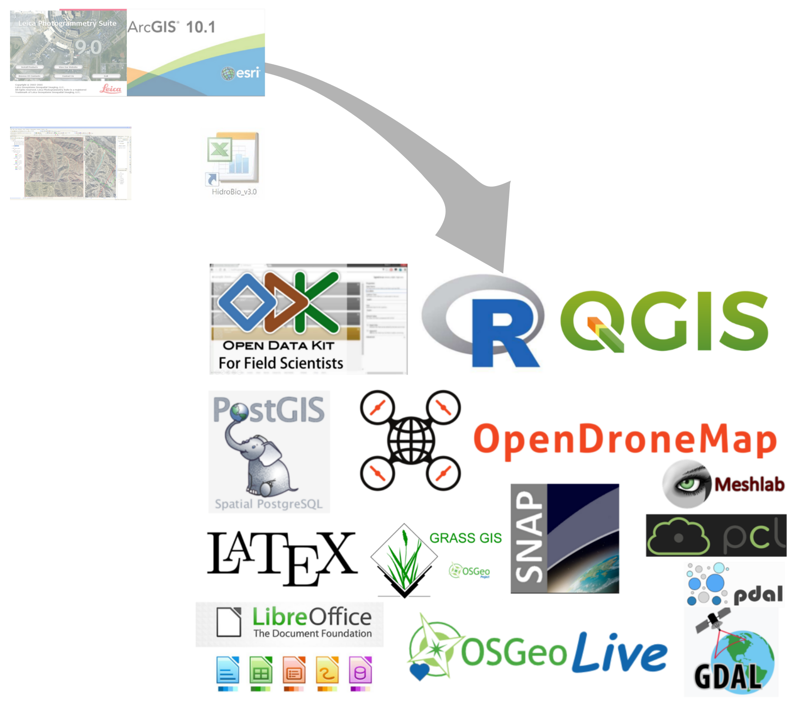

```{r setup, include=FALSE}
knitr::opts_chunk$set(echo = FALSE)
```

# Motivación

## Replicabilidad / reproducibilidad

> La ciencia está en crisis, una crisis de replicabilidad / reproducibilidad. Difícilmente un grupo de investigación reproduce el resultado que obtuvo otro. Se atribuye este déficit a que, al publicar los resultados, no se aportan ni las fuentes, ni los métodos empleados.

<p style="text-align:right;">Fdo. "El tali"</p>

## Replicabilidad / reproducibilidad

- Replicabilidad: nuevo experimento => mismos métodos => mismas conclusiones

- Reproducibilidad: usar mismos datos y métodos => mismas conclusiones.

## {width=70%}
<small> Fuente: https://www.nature.com/articles/533452a </small>

## 

## Sostenibilidad financiera y accesibilidad

{width=80%}

## Sostenibilidad financiera y accesibilidad

## 

- Software libre

- Software de código abierto

- Servicios gratuitos / servicios de pago

- ¿Hardware también?

- La diversidad en la ciencia

<!-- - Ciencia colonial, Wilson, Raven, niños en laguna de Cabral -->

- Ciencia colonial

## El manuscrito científico, y su procesamiento, como registro del conocimiento

- La industria de las editoriales científicas

- Las alternativas

- *The Map of Manuscript-Earth*

# Ecosistema / recursos

## Datos fuente


## Servicios en la nube


# Desarrollo de las asignaturas

## ¿Cómo redactar?

El apoyo fundamental es la "Guía para la redacción del manuscrito".

- Alimentar una lista de referencias útiles en formato estándar (bibtex)

- Generar resultados obtenidos mediante código reproducible. 

  - Significancia

- Redactar las partes correspondientes


## Control de versiones


## Lecciones


## Desafíos


# REFERENCIAS

<section style="font-size: 24px; text-align: left;">