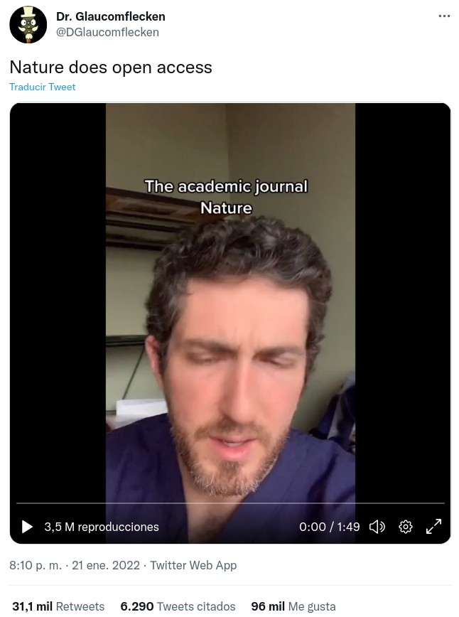
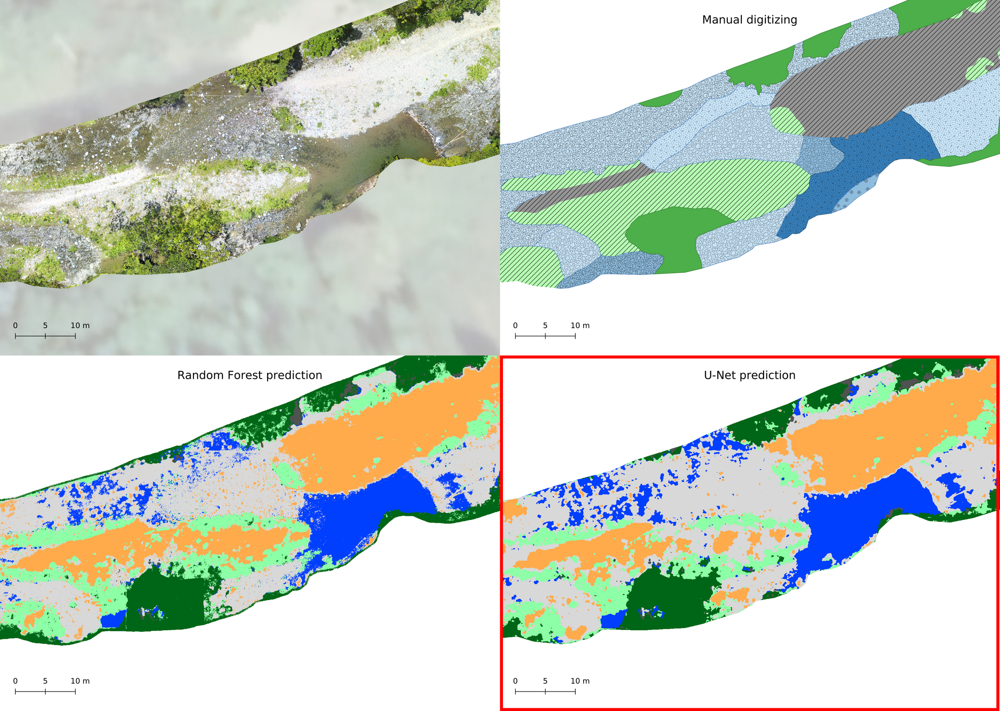
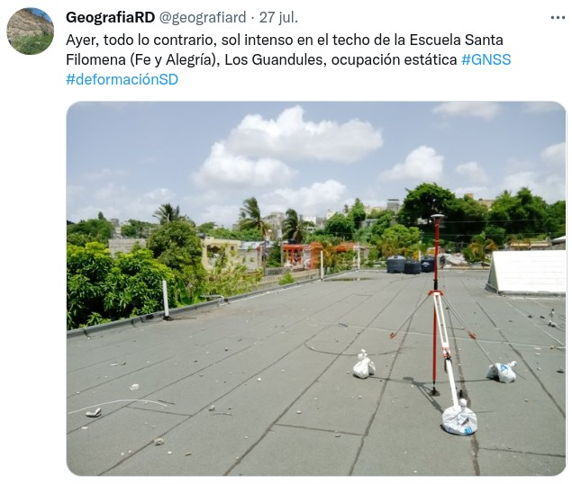

```{r setup, include=FALSE}
knitr::opts_chunk$set(echo = FALSE)
```

<style>
.scrollable-slide {
    height: 600px;
    overflow-y: auto !important;
</style>


# Guión

> De cómo evitar que nuestra "pequeña" academia se convierta nuestro infierno grande

  - El "mundillo" de la publicación científica.
  - Sorteando obstáculos.
  - ¿Qué alternativa tenemos? Ciencia abierta.
  - ¿Cómo implementarlo para estudiantes?
  - Lecciones y desafíos.
    

<!-- - De cómo pasé de enseñar las asignaturas biogeografía y geomorfología en el aula tradicional, a impulsar la **evaluación continua** basada en programación informática, estadística y redacción de **manuscritos científicos reproducibles** usando herramientas libres. -->

# ¿Cómo es el "mundillo" de la ciencia y la publicación científica?

## Proceso de revisión / publicación de artículos

- La producción de conocimiento, y su posterior publicación es, siguiendo el modelo de *bussiness as usual*, ...

  - ... extremadamente **costosa**.
  
  - ... no se garantiza la **reproducibilidad**

## 

<div class="scrollable-slide">

<small>https://biblioteca.uoc.edu/es/pagina/Publicar-un-articulo-cientifico</small>
</div>

##
<div class="scrollable-slide">

<small>Fuente: https://www.redbubble.com/es/people/redpenblackpen/works/31838013-the-map-of-manuscript-earth</small>
</div>

## {width=75%}
<small>Fuente: https://paywallthemovie.com/</small>

## 
<small>Fuente: https://sci-hub.se/</small>

## {width=50%}
<small>Fuente: https://twitter.com/DGlaucomflecken/status/1494084038671298560</small>

<!-- ##  -->
<!-- <iframe width="100%" height="600" src="" frameborder="0" allow="accelerometer; autoplay; encrypted-media; gyroscope; picture-in-picture" allowfullscreen="" data-external="1"></iframe> -->
<!-- <span style="font-size:60%;">[]()</span> -->

# Sorteando obstáculos

- Para colmo, la cosa no queda ahí. Inequidades empobrecen la producción de conocimiento.

- Desde hace quizá unos 20 años, parte de la comunidad científica está visibilizando prácticas que empobrecen el avance del conocimiento. Algunas de estas prácticas son:

## {width=75%}
<small>Ciencia colonial. Fuente: https://www.scientificamerican.com/article/the-problem-of-colonial-science/</small>

## 
<small>Racismo. Fuente: https://www.youtube.com/watch?v=gAMY0SII5gk</small>

## 
<small>Sexismo. Fuente: https://www.buzzfeednews.com/article/nishitajha/smithsonian-tropical-research-institute-metoo</small>

## Inglés como idioma por defecto


<small>Fuente: https://doi.org/10.1371/journal.pone.0238372</small>

## 
<small>Fuente: https://doi.org/10.1073/pnas.2119373119</small>


## 

<small>Esquema "Profzi". Fuente: https://phdcomics.com/comics/archive_print.php?comicid=1144</small>


## Además ...

- LGTBIfobia.

- Elitismo.

- Gatekeeping.

- Y otros ...

## {width=65%}
<small>"Naturalistas" en la bibliografía. Fuente: Lomolino et. al (2010)</small>

## Y también #leavingacademia ...

{width=65%}
<small>¿Llegó la renunncia masiva a la academia? Fuente: https://www.nature.com/articles/d41586-022-01512-6</small>

## {width=80%}

<small>Consejos. Fuente: https://www.apa.org/monitor/2022/03/career-leaving-academia</small>

# ¿Qué alternativa tenemos? Ciencia abierta

- Replicabilidad / reproducibilidad.

- Sostenibilidad: proyectos, hardware, software.

- Acceso diamante y proceso de publicación transparante.

- Casos de éxito, aplicaciones.

## Replicabilidad / reproducibilidad

- La ciencia está en crisis ... de replicabilidad / reproducibilidad. Difícilmente un grupo de investigación reproduce el resultado que obtuvo otro. Se atribuye este déficit a que, al publicar los resultados, no se aportan ni las fuentes, ni los métodos empleados.

## Replicabilidad / reproducibilidad

- Replicabilidad: nuevo experimento => mismos métodos => mismas conclusiones

- Reproducibilidad: aplicar mismos métodos a mismos <br> datos => mismas conclusiones.

## {width=70%}
<small> Fuente: https://www.nature.com/articles/533452a </small>

## 

## Sostenibilidad: "proyectos" de presupuesto CERO

## {width=80%}

## 

## 

## {width=45%}

<small>Presupuesto 0, sin inv. principal, sin "antecedentes". Fuente: https://twitter.com/rdpalacio/status/1585038230587858944</small>

## Sostenibilidad: software

{width=70%}

## Sostenibilidad: hardware

- No olvidemos el hardware: para hacer ciencia de la forma tradicional, normalmente se necesitan costosos equipos. Las alternativas son:

  - Hardware DIY.
  
  - Hardware de bajo costo sin ataduras a licencias privativas.

## 

## 

<small>Comunidad de hardware para ciencia abierta. Twitter: \@GOSHCommunity</small>

## Acceso diamante y proceso de publicación transparante


<small>Fuente: https://animsci.peercommunityin.org/help/help_generic#h_96049776012201619025558632</small> 

## Casos de éxito, aplicaciones

## 

##
{width=65%}


## 

## {width=60%}

## 

## 

## 

## 

## 

# ¿Cómo implementarlo para estudiantes?

## Básicamente ...

El apoyo fundamental es la "Guía para la redacción del manuscrito".

- Alimentar una lista de referencias útiles en formato estándar (Zotero)

- Generar resultados obtenidos mediante código reproducible.

- Insertar en el manuscrito el soporte gráfico y analítico generado.

- Redactar las partes correspondientes usando la guía.

- Solicitar ayuda, para todo lo anterior.

##

<div class="scrollable-slide">

</div>

# Lecciones y desafíos

## Lecciones aprendidas: programación

- Libertad para elegir lenguajes, incluso herramientas.

- "Informática 101" es un lugar idóneo para comenzar a enfrentarse a los lenguajes.

## Lecciones aprendidas: análisis y redacción.

- El esquema IMRaD no es intuitivo.

- El AED es el primer paso, después, lo que quieras.

- Tenemos muchas tareas pendientes en nuestro sistema educativo, pero **fomentar la capacidad de extraer conclusiones a partir análisis e interpretación es fundamental**.

- Organización de secciones.

- El párrafo y la fluidez del texto.

- Sobre virtualidad.

## Desafíos

- Vuelta a la presencialidad.

- Incoporación de la visita de campo al flujo de trabajo.

- Mantenimiento en el tiempo del soporte informático.


# REFERENCIAS

<section style="font-size: 24px; text-align: left;">